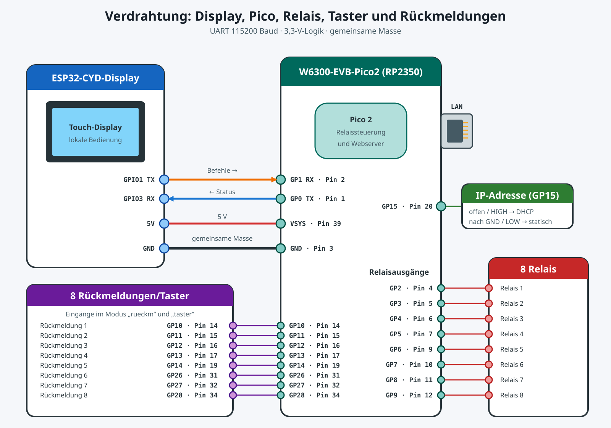

# Relais-Webserver

Dieses Repository enthält zwei Module für eine 8-Kanal-Relaissteuerung:

| Verzeichnis | Zielplattform | Status |
|---|---|---|
| `esp32/` | ESP32-CYD mit LVGL-Touchpanel | lokales Schalt-Terminal (serieller Befehlssender) |
| `pico/switch_server/` | C++/Pico-SDK für W6300-EVB-PICO2 | native W6300-QSPI-Variante |

### Benutzerhandbuch in der Datei `MANUAL.md`

## Systemüberblick: ESP32-Terminal + Pico-Implementierung



### Verkabelung zwischen Display und Pico

Die Kommunikation zwischen dem ESP32-Displayterminal und der Pico-Firmware läuft über UART mit 115200 Baud.
Die Verbindung geht über das vierpolige Kabel 

GPIO-Belegung:

- ESP32-Terminal: UART0 (`GPIO1` = TX, `GPIO3` = RX)
- Pico-Firmware: UART0 (`GP0` = TX, `GP1` = RX)

Verdrahtung (gekreuzt, TX auf RX):

| ESP32-CYD | Pico 2 (RP2350) | Zweck |
|---|---|---|
| GPIO1 (TX) | GP1 (RX) | ESP32 sendet Schaltbefehle zum Pico |
| GPIO3 (RX) | GP0 (TX) | Pico sendet Status/Antworten zum ESP32 |
| GND | GND | Gemeinsame Masse |

Wichtige Hinweise:

- Beide Boards arbeiten mit 3,3-V-Logikpegeln (keinen 5-V-UART anschließen).
- TX und RX müssen immer gekreuzt verbunden sein.
- Die USB-Verbindungen der Boards bleiben zusätzlich für Stromversorgung, Flashen und Debugging nutzbar.
- Verwendetes Textprotokoll auf der Leitung: z. B. `SW1:ON`, `SW1:OFF`, `SCENE1:GO`, `GET DISPLAY`, `VER:<version>`, `PING`/`PONG`. Das vollständige Protokoll ist in `MANUAL.md` und `CLAUDE.md` beschrieben.

### esp32/

Stellt das lokale Touch-Terminal bereit (8 Tasten, ON/OFF-Statusfarben, Szenenansicht, Rückmeldefehleranzeige).
- Bei jeder Bedienung sendet das ESP32-Terminal einen zeilenbasierten Befehl (`SWn:ON`/`SWn:OFF` bzw. `SCENEn:GO`) über UART an den Pico.
- Im Szenenmodus erscheint auf der aktiven Szenen-Taste ein roter Punkt, sobald ein Relais direkt (nicht über eine Szene) geschaltet wurde. Der Punkt erlischt bei der nächsten Szenenaktivierung.

### pico/switch_server/

Enthält die eigentliche Relais- und Netzwerk-Firmware und implementiert:
- Einzelrelaissteuerung und Szenen
- Eingangsmodus per Compilerschalter `INPUT_MODE` (Default `taster`): entweder physische **Rückmeldeüberwachung** (`rueckm`) oder entprellte **Taster** an GP10–28 (`taster`), die je ein Relais toggeln (parallel zu Web/Display; im Szenenmodus lösen sie Szenen aus)
- Rückmeldeüberwachung: Prüfung, ob Relais geschaltet haben
- HTTP-UI-Webserver
- REST-API-Server mit API-Token
- Persistenz der Einstellungen
- Authentifizierung und Benutzerverwaltung
- SSE: Automatisches Update der Webclients
- Versionsanzeige: Im Web-Footer werden beide Firmware-Versionen als `Firmware pico: xx.xxxxx.g<hash>  esp32: yy.yyyyy.g<hash>` angezeigt. Format: manuelle Hauptversion `xx`/`yy`, automatischer Git-Commit-Count `xxxxx`/`yyyyy` und der kurze Commit-Hash `g<hash>`. Zusätzliche Marker: `-dirty` bei uncommittetem Stand, `+N` für N lokal noch nicht gepushte Commits (nur mit konfiguriertem Upstream). Der Hash macht den Stand eindeutig rückverfolgbar. Hauptversion: Pico `FW_MAJOR` in `pico/switch_server/CMakeLists.txt`, ESP32 `ESP_FW_MAJOR` in `esp32/version.py`. Der ESP32 meldet seine Version per `VER:<version>` über UART an den Pico; ohne verbundenes Display steht dort `esp32: -`.
- Optionales ESP-Touchdisplay über die serielle Schnittstelle (`esp_link`-Protokoll) schaltet die realen GPIO-Relais und meldet Titel, Namen, Modus und Zustände live an das Display zurück.

Typischer Ablauf des Zusammenspiels im Überblick:

1. Bediener tippt auf dem ESP32-Terminal einen Kanal oder eine Szene.
2. ESP32 erzeugt den seriellen Befehl (`SWn:ON/OFF` bzw. `SCENEn:GO`).
3. Der Pico verarbeitet den Befehl direkt über UART0 (`esp_link`).
4. Der Pico setzt den Relaiszustand, speichert ihn persistent und verteilt den neuen Zustand per API/SSE an Webclients sowie per UART zurück an das Display.

Damit bleibt die Verantwortung sauber getrennt: ESP32 = lokale Bedienoberfläche, Pico = zentrale Steuer- und Netzwerkinstanz.

### Dual-Core-Architektur (RP2350): Relais schalten immer

Das Schalten der Relais muss **immer** funktionieren — unabhängig vom LAN-Zustand
(kein Kabel, Kabel gezogen/wieder gesteckt, laufende DHCP-Suche, hängende TCP-
Verbindungen). Die blockierenden WIZnet-Aufrufe (`send`/`recv`/`sendto`/`disconnect`
warten per Busy-Loop) würden in einer einzigen Schleife das Relais- und Display-
Handling aushungern. Die Firmware nutzt deshalb **beide Kerne** des RP2350:

- **core0 (Steuerung):** ESP-UART (`esp_link`), Relais-GPIO, Rückmeldungen, Szenen.
  Fasst **niemals** W6300 oder Flash an → kann nicht blockieren → Relais reagieren
  sofort, egal was das Netzwerk gerade macht.
- **core1 (Netzwerk):** W6300, HTTP-Server, DHCP, SSE-Live-Updates und das
  Flash-Schreiben. Darf blockieren, ohne core0 zu stören.

Synchronisation bewusst minimalistisch und deadlock-frei: ein einziger
`recursive_mutex_t` schützt den geteilten Zustand (nie über Netz-I/O oder Flash
gehalten), Aufträge laufen über wenige `volatile`-Flags zwischen den Kernen
(z. B. „SSE senden", „Flash speichern", „IP-Status ans Display"). Flash-Schreiben
läuft nur auf core1 über `flash_safe_execute()`, während core0 als
Lockout-Victim pausiert (`flash_range_erase` sperrt sonst beide Kerne). Details:
Abschnitt „2.7 Dual-Core-Architektur" in `CLAUDE.md`.


## Kompilierung und Hochladen 

### Kurzanleitung für PICO und ESP32

Der Pico und das ESP32-CYD-Display müssen getrennt geflasht werden. Jedes Modul hat seinen eigenen USB-C-Anschluss.
Beim Programmieren immer nur ein Modul anschließen.
Zum Flashen des Pico muss dieser bei gedrückter Taste (die erste beim USB-Anschluss) eingeschaltet werden.
Zum Flashen des ESP32 muss die serielle Verbindung zwischen dem Pico (GP0 und GP1) und dem ESP32 getrennt werden.
Beim ersten Aufruf der Upload-Skripte werden einige Dateien aus dem Netz geladen.

```bash
cd esp32
./upload.sh

cd ..

cd pico
./upload.sh 

```

Das Skript `pico/upload.sh` klont den Code `pico/WIZnet-PICO-C` beim ersten Lauf automatisch aus dem Netz. Daher kann das erste kompilieren etwas länger dauern. WIZnet ist per `.gitignore` augenommen. 

### Nur Firmware-Images flashen (ohne Build) — `pico-switch-fw-update.sh`

Zum Verteilen/Aufspielen **fertiger** Firmware ohne Quellcode-Build gibt es
`pico-switch-fw-update.sh` (Repo-Wurzel). Es flasht **ohne BOOTSEL-Taste**:
Pico per `picotool` (Software-Reboot in BOOTSEL), ESP32 per `esptool` über die
serielle USB-Brücke.

```bash
./pico-switch-fw-update.sh            # Auto: flasht, wozu ein Image (*.uf2/*.bin) im cwd liegt
./pico-switch-fw-update.sh -p         # nur Pico (*.uf2 aus aktuellem Verzeichnis)
./pico-switch-fw-update.sh -e         # nur ESP32 (*.bin aus aktuellem Verzeichnis)
./pico-switch-fw-update.sh -i fw.uf2  # Image explizit (Endung wählt Ziel)
./pico-switch-fw-update.sh --esp32-image app.bin --port /dev/ttyUSB0
```

- **Images** liegen im aktuellen Verzeichnis (`*.uf2` = Pico, `*.bin` = ESP32)
  oder werden per `-i` / `--pico-image` / `--esp32-image` angegeben.
- Das Skript **prüft die benötigten Programme** (`picotool` bzw. `esptool`).
  Fehlt etwas, listet es die fehlenden Komponenten auf und fragt, ob sie
  installiert werden sollen; nach der Installation fragt es, ob geflasht wird.
- ESP32-Default-Offset ist `0x10000` (App-Update; Bootloader/Partitionen bleiben).
  Für ein zusammengeführtes (merged) Image `--esp32-offset 0x0` verwenden.
- Zum ESP32-Flashen muss die UART-Verbindung Pico↔ESP32 (GP0/GP1) getrennt sein.


### Kompilierung und Hochladen im Detail (normalerweise nicht notwendig)


#### ESP32-Terminal (`esp32/`)

Kompilieren und Hochladen über ein Hilfsskript:

```bash
cd esp32
./upload.sh
```

Kompilieren (PlatformIO):

```bash
cd esp32
pio run -e cyd
```

Alternative Display-Variante:

```bash
pio run -e cyd2usb
```

Flashen auf das ESP32-Board:

```bash
pio run -e cyd -t upload
```

#### Pico-Implementierung (`pico/`)

Empfohlen: Helper-Skript `pico/upload.sh`. **Standardmäßig flasht es ohne
BOOTSEL-Taste** über USB (`picotool`): Der laufende Pico wird per Software in den
BOOTSEL-Modus versetzt, geflasht und automatisch neu gestartet.

```bash
cd pico
./upload.sh                    # Build + USB-Flash OHNE BOOTSEL-Taste (Default)
./upload.sh -c                 # Clean-Build erzwingen
./upload.sh -m rueckm          # Eingangsmodus Rückmeldung (Default: taster)
./upload.sh -w                 # EINMAL-Werksreset: Persistenz beim Boot löschen (s. u.)
./upload.sh -d                 # Klassisch: UF2 auf BOOTSEL-Laufwerk kopieren
./upload.sh /pfad/zum/RP2350   # UF2 auf ein bestimmtes BOOTSEL-Laufwerk kopieren
```

- **Ohne BOOTSEL (Default):** Der Pico muss mit laufender Firmware per USB
  verbunden sein; `picotool` (mit USB-Support) muss installiert sein. Kein
  Tastendruck, kein manuelles Umstecken nötig.
- **Mit BOOTSEL (`-d`/`--drive` oder UPLOAD_DIR):** Klassischer Weg über das
  gemountete `RP2350`-Laufwerk (siehe unten).

`upload.sh` klont beim ersten Aufruf die benötigten Abhängigkeiten.

##### Werksreset: gespeicherte Konfiguration löschen (`-w` / `--wipe-persist`)

Die Einstellungen liegen in festen Flash-Slots **außerhalb** des Programm-Images
und überstehen deshalb ein normales Reflashen. Enthält der Flash jedoch einen
Datensatz mit **inkompatiblem Speicherformat** (andere `PERSIST_VERSION`, z. B.
nach einem verworfenen Branch), erkennt die Firmware das beim Boot und **sperrt
zum Schutz jedes weitere Speichern** — die Konfiguration bleibt dann nach einem
Neustart oder Reflashen nicht mehr erhalten.

Mit `-w` baut das Skript eine Firmware, die beim Boot **einmalig** alle
Persistenz-Slots löscht. Danach speichert die normale Firmware wieder korrekt.
Der Ablauf umfasst **zwei** Flash-Vorgänge (Reihenfolge einhalten):

```bash
cd pico
./upload.sh -w    # 1) Werksreset-Firmware flashen: löscht beim Boot die Persistenz
                  #    kurz laufen lassen (USB-Konsole zeigt "PERSIST_WIPE: ... geloescht")
./upload.sh       # 2) normale Firmware flashen: entfernt den Boot-Wipe wieder
```

- **Schritt 2 nicht vergessen:** Solange die `-w`-Firmware installiert ist,
  löscht jeder Boot erneut. Erst die normale Firmware macht die Persistenz dauerhaft.
- `-w` bei Bedarf mit `-m taster|rueckm` kombinieren (Default `taster`).
- Nach dem Reset gelten die Werkseinstellungen inkl. Login `admin` / `sw234`.

Zum Flashen über ein **BOOTSEL-Laufwerk** (`-d`/`--drive` oder UPLOAD_DIR-Argument)
muss der Pico im BOOTSEL-Modus sein:

1. `BOOTSEL` am Pico gedrückt halten.
2. Pico per USB verbinden, dann `BOOTSEL` loslassen.
3. Das Skript kopiert die UF2 automatisch nach `/media/$USER/RP2350` (oder das
   übergebene Ziel). Manuell kann die UF2 auch direkt aufs Laufwerk kopiert werden.

Ohne `-d`/UPLOAD_DIR ist das **nicht nötig** — dann flasht das Skript per
`picotool` über USB, ohne die BOOTSEL-Taste.

Alternativer manueller Build ohne Skript:

```bash
cd pico/switch_server
cmake -S . -B build -DCMAKE_BUILD_TYPE=Release
cmake --build build -j$(nproc)
```

Erzeugte UF2-Datei:

```text
pico/switch_server/build/switch_w6300_relay.uf2
```

CMake-Targets: `switch_w6300_relay` (Produktiv-Firmware) und
`uart_loopback_test` (UART0-Diagnose). Weitere Details: `pico/README.md`.

## Installation der benötigten Tools

Die folgenden Schritte gelten für Debian/Ubuntu/Linux Mint.

### Pico (C++ / RP2350 + W6300)

ARM-Toolchain und Build-Werkzeuge installieren:

```bash
sudo apt-get update
sudo apt-get install -y \
  cmake \
  build-essential \
  git \
  gcc-arm-none-eabi \
  libnewlib-arm-none-eabi \
  libstdc++-arm-none-eabi-newlib \
  python3
```

Installation prüfen:

```bash
cmake --version
arm-none-eabi-gcc --version
```

WIZnet-PICO-C (Pico SDK, ioLibrary_Driver) inkl. Submodulen bereitstellen. Das
Skript `pico/upload.sh` klont den Code beim ersten Lauf automatisch nach
`pico/WIZnet-PICO-C` (per `.gitignore` ausgenommen). Der folgende Befehl kann
alternativ manuell im `pico/`-Verzeichnis ausgeführt werden.

```bash
git clone --recursive https://github.com/WIZnet-ioNIC/WIZnet-PICO-C.git WIZnet-PICO-C
cd WIZnet-PICO-C && git submodule update --init --recursive
```

Details und alternative Checkout-Pfade: `pico/README.md`.

> **WIZnet-Port bleibt unverändert:** Der WIZnet-Beispiel-Port wartet in
> `wizchip_initialize()` von Haus aus endlos auf einen PHY-Link und würde damit
> ohne gestecktes LAN-Kabel den kompletten Boot (inkl. ESP-Display-Link)
> blockieren. Die Firmware ruft diese Funktion daher nicht auf, sondern nutzt eine
> eigene, nicht-blockierende Init (`wizchip_init_no_phy_wait()` in
> `relay_server.cpp`); der zeitbegrenzte Link-Check erfolgt anschließend in
> `wait_for_phy_link()`. Der geklonte WIZnet-PICO-C-Code bleibt dadurch komplett
> unverändert — kein Patch am Fremdcode, kein Zusatzskript.

### ESP32-CYD (PlatformIO)

PlatformIO Core (`pio`) wird zum Bauen und Flashen benötigt. Empfohlen über
`pipx` (immer aktuell); die apt-Version (4.3.x) ist mit Python 3.12 nicht
lauffähig und sollte nicht verwendet werden.

```bash
sudo apt remove -y platformio   # falls die kaputte apt-Version installiert ist
sudo apt install -y pipx
pipx ensurepath
pipx install platformio
```

Neues Terminal öffnen (wegen `ensurepath`) und prüfen:

```bash
pio --version
```

Die Toolchains und Bibliotheken (LVGL, TFT_eSPI, XPT2046) lädt PlatformIO beim
ersten Build automatisch. Falls `pio` nicht gefunden wird:
`export PATH="$HOME/.local/bin:$PATH"`.


## Vom Versionsstring zum GitHub-Stand


**Aufbau des Versions-Formats** `xx.xxxxx.g<hash>[-dirty][+N]`:

Beispiel:

```
05.00019.g71704ee-dirty
```
| Teil | Beispiel | Bedeutung |
|---|---|---|
| `05` | Hauptversion | manuell in CMakeLists.txt (`FW_MAJOR`) |
| `00019` | 19 | Git-Commit-Count |
| `g71704ee` | Hash `71704ee` | kurzer Commit-Hash |
| `-dirty` | Flag | Build aus uncommittetem Arbeitsstand |
| `+N` | Marker | Anzahl der Commits, die der lokale Build dem konfigurierten Upstream (GitHub) **voraus** ist |

 
`-dirty` bedeutet: exakter Build-Stand liegt in **keinem** Commit; `71704ee` ist nur
  die nächstliegende Basis.
  **Achtung `-dirty`:** Diese Firmware wurde aus einem Arbeitsstand mit nicht eingecheckten Änderungen gebaut; der genannte Commit ist dann nur die nächstliegende Basis und liegt nicht 1:1 auf GitHub. Nur Versionen **ohne** `-dirty` entsprechen exakt einem Commit.

`+N` (z. B. `05.00019.g71704ee+2`):
 
   `N` ist die Anzahl der Commits, die der lokale Build dem konfigurierten Upstream (GitHub) **voraus** ist — also lokal committet, aber noch **nicht gepusht** (`git rev-list --count @{u}..HEAD`). Der Hash `g71704ee` liegt dann noch **nicht** auf GitHub; dort steht der Stand `N` Commits davor. Nach `git push` verschwindet das `+N` und der Hash entspricht exakt dem Remote-Stand. Der Marker erscheint nur bei konfiguriertem Upstream (Tracking-Branch).


Rückverfolgung zu GitHub:

Der Teil `g<hash>` ist der kurze Git-Commit-Hash (das führende `g` = „git"). Beispiel `05.00019.g71704ee` → Commit `71704ee`.


  ```https://github.com/<owner>/<repo>/commit/71704ee ```  

  ```
  git show 71704ee 
  git checkout 71704ee  
  ```
Den Remote-Namen `<owner>/<repo>` liefert ```git remote -v```.


Projekt gebaut von OE5RNL, OE5NVL und Claude

## Lizenz

Dieses Projekt ist unter der [MIT-Lizenz](LICENSE) veröffentlicht.